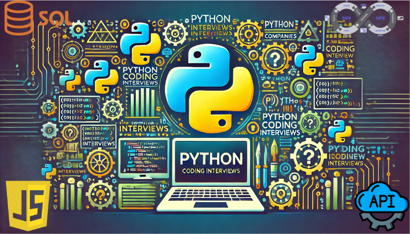

# 🚀 Holberton Higher-Level Programming  

  

---

## 👨‍💻 About the Developer  

Hi, I'm **Abimael Pérez Vega**, a software developer passionate about **Python, JavaScript, SQL, RESTful APIs, and DevOps**. This repository is a collection of projects covering **advanced programming concepts** that are essential for real-world development.  

📌 **Connect with me on** [LinkedIn](https://www.linkedin.com/in/abimael-perez-vega-8870b6320/)  

---

## 📜 Project Overview  

The **Holberton Higher-Level Programming** repository is designed to build a strong foundation in **Python, JavaScript, SQL, APIs, and system-level programming**. This repo contains multiple projects, each covering essential topics like **object-oriented programming, data structures, database management, and web development**.  

### **📂 Repository Structure**  

holberton-higher_level_programming/ ├── devops_essentials/ ├── javascript-dom_manipulation/ ├── python-abc/ ├── python-classes/ ├── python-data_structures/ ├── python-everything_is_object/ ├── python-exceptions/ ├── python-hello_world/ ├── python-if_else_loops_functions/ ├── python-import_modules/ ├── python-inheritance/ ├── python-input_output/ ├── python-more_classes/ ├── python-more_data_structures/ ├── python-object_relational_mapping/ ├── python-serialization/ ├── python-server_side_rendering/ ├── python-test_driven_development/ ├── restful-api/ ├── SQL_introduction/ ├── SQL_more_queries/ └── README.md

---

## 📌 Folder Breakdown  

### 🛠 **DevOps Essentials**  
- Covers fundamental **Linux commands**, shell scripting, and DevOps tools.  
- Focuses on **automation, system administration, and environment setup**.  

### 🌐 **JavaScript DOM Manipulation**  
- Introduction to **manipulating HTML & CSS dynamically** using JavaScript.  
- Focuses on **event handling, selectors, and modifying elements on a webpage**.  

### 🏛 **Python ABC (Abstract Base Classes)**  
- Explains **abstract classes and interfaces** in Python.  
- Focuses on **structuring code using abstract base classes**.  

### 🔲 **Python Classes**  
- Covers **object-oriented programming (OOP)** concepts in Python.  
- Implements **constructors, attributes, methods, and encapsulation**.  

### 📊 **Python Data Structures**  
- Introduces **lists, tuples, sets, and dictionaries** for efficient data handling.  
- Covers **algorithms for searching, sorting, and modifying data**.  

### 🧩 **Python Everything is an Object**  
- Deep dive into **Python's object model**, references, mutability, and identity.  
- Explores **how Python handles objects in memory**.  

### ⚠️ **Python Exceptions**  
- Teaches **error handling** using `try`, `except`, and `finally`.  
- Focuses on **raising custom exceptions and handling multiple error types**.  

### 👋 **Python Hello World**  
- First steps into Python, covering **print statements, comments, and basic syntax**.  

### 🔄 **Python If/Else, Loops, and Functions**  
- Explains **conditional statements, loops, and function definitions**.  
- Covers **recursion, lambda functions, and scope**.  

### 📦 **Python Import Modules**  
- Covers **importing and using external libraries**.  
- Explains **module creation, `__name__ == "__main__"` usage, and namespace handling**.  

### 👨‍👩‍👦 **Python Inheritance**  
- Explores **single and multiple inheritance** in Python OOP.  
- Teaches **method overriding, superclass access, and polymorphism**.  

### 📄 **Python Input/Output**  
- Covers **file handling**, reading and writing data to files.  
- Introduces **JSON serialization and deserialization**.  

### 🏗 **Python More Classes**  
- Expands on **OOP concepts**, focusing on advanced class functionalities.  

### 🛠 **Python More Data Structures**  
- Covers **set operations, dictionary comprehensions, and advanced data structures**.  

### 🔗 **Python Object Relational Mapping (ORM)**  
- Introduces **SQLAlchemy** for managing databases using Python.  
- Covers **CRUD operations, table relationships, and database transactions**.  

### 🔄 **Python Serialization**  
- Covers **serialization techniques** using `pickle`, and `json`.  

### 🖥 **Python Server-Side Rendering**  
- Focuses on **rendering dynamic web pages on the server** using Flask/Jinja.  

### 🧪 **Python Test-Driven Development (TDD)**  
- Introduces **unit testing** using `unittest` and `doctest`.  
- Covers **writing test cases before coding** to ensure reliability.  

### 🌍 **RESTful API**  
- Covers **building and consuming REST APIs**.  
- Focuses on **HTTP methods (GET, POST, PUT, DELETE) and JSON data exchange**.  

### 🗄 **SQL Introduction**  
- Covers **basic SQL commands** for managing databases.  
- Focuses on **SELECT, INSERT, UPDATE, DELETE, and filtering data**.  

### 🔍 **SQL More Queries**  
- Covers **joins, subqueries, views, stored procedures, and transactions**.  

---

## 🚀 Learning Experience  

This repository has been an **invaluable learning experience** in **higher-level programming**. While some concepts were challenging, mastering **Python, JavaScript, SQL, and APIs** has been extremely rewarding. These projects have helped strengthen my **coding skills, problem-solving abilities, and real-world software development knowledge**.  

---

## 🔧 How to Use This Repository  

1. **Clone the Repository**  
   git clone https://git@github.com:AbimaelPerezVega/holbertonschool-higher_level_programming.git
